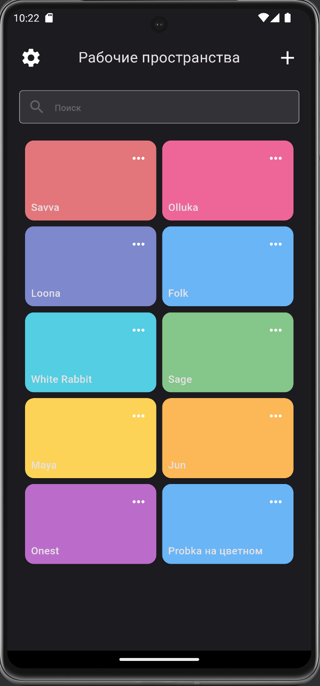
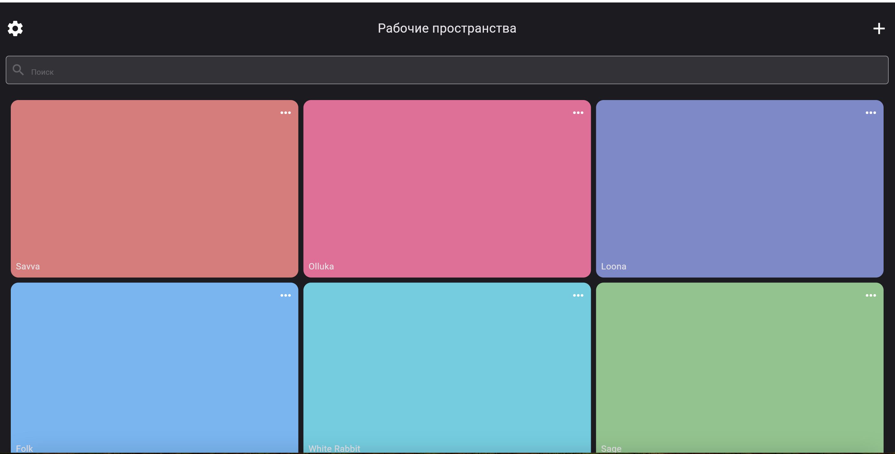

# Test adaptive ui





## Installation

1. Make sure you have the latest version of Flutter SDK installed.
2. Clone the repository:

    ```sh
    git clone https://github.com/Murat0126/testAadaptiveUoi.git
    ```

3. Navigate to the project directory:

    ```sh
    cd testAadaptiveUoi
    ```

4. Install the dependencies:

    ```sh
    flutter pub get
    ```

## Usage

To run the application, use the following command:

```sh
flutter run
```

